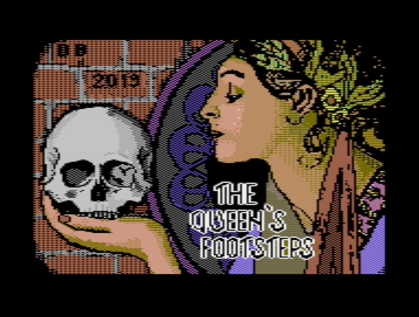

# The Queen's Footsteps
## A high steam pressure adventure

* Today is August 27th, 1904. Nine months ago, you, Emilia Vittorini, joined the Italian Archeological Expedition in Egypt led by Ernesto Schiaparelli, the director of the Egyptian Museum of Turin. You are now back in Genoa, Italy: your steam ferry arrived three days ago with 25 wooden boxes containing Queen Nefertari Meritmut's grave goods, a real treasure! They left Genoa by train, heading towards Turin, yesterday evening. While they were in transit, you were invited to a sumptuous reception organised by a wealthy art lover, Eugenio Collovati, count of Raligotto, but it would be hard to say that you appreciated the evening.

But the reception was yesterday: now, you must catch the train to Turin and check that the treasure arrived safely. I will be your eyes and ears. Good luck. *

More information here:

http://davbucci.chez-alice.fr/index.php?argument=varie/queen/queen.inc&language=English

This repository contains the full source code of The Queen's Footsteps, written in AWS (Adventure Writing System). In order to compile it on your target system, you will need:

- AWS2C in your repository (many scripts here expect that this repository is a submodule of [AWS2C](https://github.com/DarwinNE/aws2c))
- the GNU Make utility
- A competent C compiler for your target platform (e.g. cc65 for the Commodore VIC20 or C64 or z88dk for the Sinclair ZX Spectrum)
- A set of associate tools that usually depend on the platform. See the file /build/config.sh to have the list. Modify that file with the path of the different tools as they are installed in your system.

